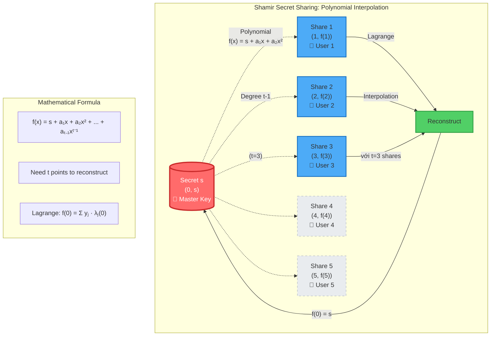

```mermaid
graph TD
    subgraph "Shamir Secret Sharing: Polynomial Interpolation"
        A[("Secret s<br/>(0, s)<br/>🔑 Master Key")]
        
        B["Share 1<br/>(1, f(1))<br/>👤 User 1"]
        C["Share 2<br/>(2, f(2))<br/>👤 User 2"]
        D["Share 3<br/>(3, f(3))<br/>👤 User 3"]
        E["Share 4<br/>(4, f(4))<br/>👤 User 4"]
        F["Share 5<br/>(5, f(5))<br/>👤 User 5"]
        
        A -.->|"Polynomial<br/>f(x) = s + a₁x + a₂x²"| B
        A -.->|"Degree t-1"| C
        A -.->|"(t=3)"| D
        A -.-> E
        A -.-> F
        
        B -->|"Lagrange"| G[Reconstruct]
        C -->|"Interpolation"| G
        D -->|"với t=3 shares"| G
        
        G -->|"f(0) = s"| A
        
        style A fill:#ff6b6b,stroke:#c92a2a,stroke-width:3px,color:#fff
        style B fill:#4dabf7,stroke:#1971c2,stroke-width:2px
        style C fill:#4dabf7,stroke:#1971c2,stroke-width:2px
        style D fill:#4dabf7,stroke:#1971c2,stroke-width:2px
        style E fill:#e9ecef,stroke:#adb5bd,stroke-width:1px,stroke-dasharray: 5 5
        style F fill:#e9ecef,stroke:#adb5bd,stroke-width:1px,stroke-dasharray: 5 5
        style G fill:#51cf66,stroke:#2f9e44,stroke-width:2px
    end
    
    subgraph "Mathematical Formula"
        H["f(x) = s + a₁x + a₂x² + ... + aₜ₋₁xᵗ⁻¹"]
        I["Need t points to reconstruct"]
        J["Lagrange: f(0) = Σ yⱼ · λⱼ(0)"]
    end
```