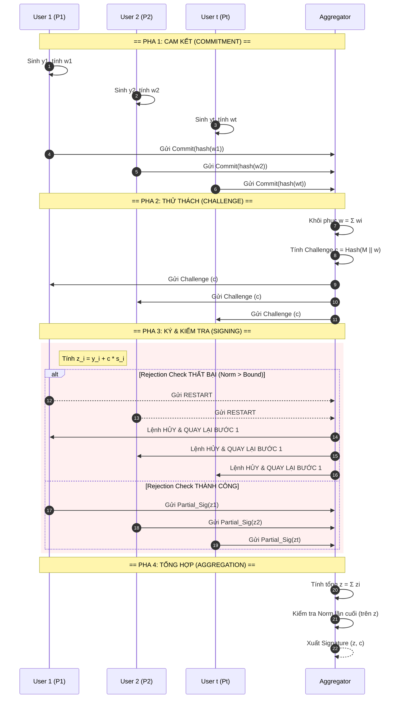

```mermaid
sequenceDiagram
    autonumber
    participant P1 as User 1 (P1)
    participant P2 as User 2 (P2)
    participant Pt as User t (Pt)
    participant Agg as Aggregator

    Note over P1, Agg: == PHA 1: CAM KẾT (COMMITMENT) ==
    
    P1->>P1: Sinh y1, tính w1
    P2->>P2: Sinh y2, tính w2
    Pt->>Pt: Sinh yt, tính wt

    P1->>Agg: Gửi Commit(hash(w1))
    P2->>Agg: Gửi Commit(hash(w2))
    Pt->>Agg: Gửi Commit(hash(wt))

    Note over P1, Agg: == PHA 2: THỬ THÁCH (CHALLENGE) ==

    Agg->>Agg: Khôi phục w = Σ wi
    Agg->>Agg: Tính Challenge c = Hash(M || w)

    Agg->>P1: Gửi Challenge (c)
    Agg->>P2: Gửi Challenge (c)
    Agg->>Pt: Gửi Challenge (c)

    Note over P1, Agg: == PHA 3: KÝ & KIỂM TRA (SIGNING) ==

    rect rgb(255, 240, 240)
        Note right of P1: Tính z_i = y_i + c * s_i
        
        alt Rejection Check THẤT BẠI (Norm > Bound)
            P1-->>Agg: Gửi RESTART
            P2-->>Agg: Gửi RESTART
            Agg->>P1: Lệnh HỦY & QUAY LẠI BƯỚC 1
            Agg->>P2: Lệnh HỦY & QUAY LẠI BƯỚC 1
            Agg->>Pt: Lệnh HỦY & QUAY LẠI BƯỚC 1
        else Rejection Check THÀNH CÔNG
            P1->>Agg: Gửi Partial_Sig(z1)
            P2->>Agg: Gửi Partial_Sig(z2)
            Pt->>Agg: Gửi Partial_Sig(zt)
        end
    end

    Note over P1, Agg: == PHA 4: TỔNG HỢP (AGGREGATION) ==

    Agg->>Agg: Tính tổng z = Σ zi
    Agg->>Agg: Kiểm tra Norm lần cuối (trên z)
    Agg-->>Agg: Xuất Signature (z, c)
```
